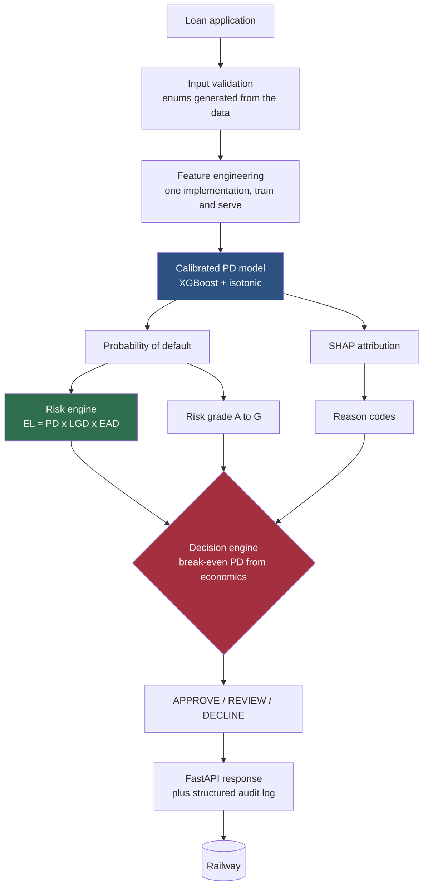
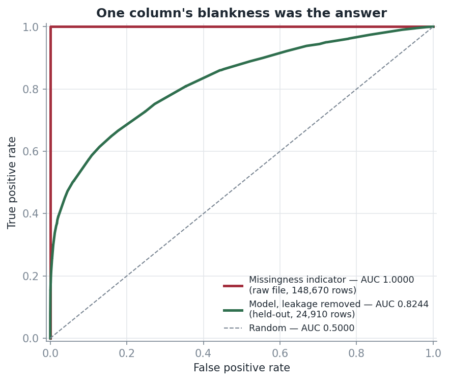
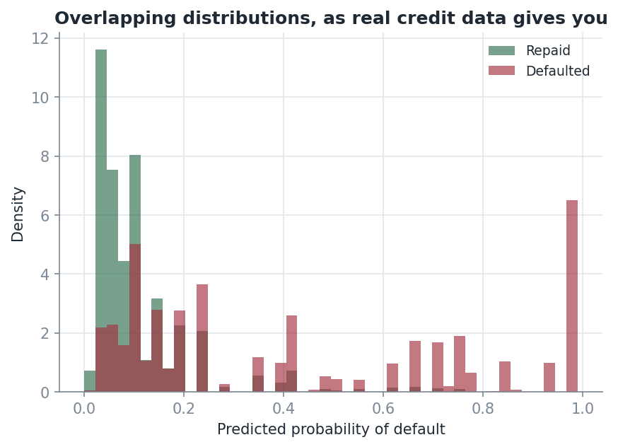
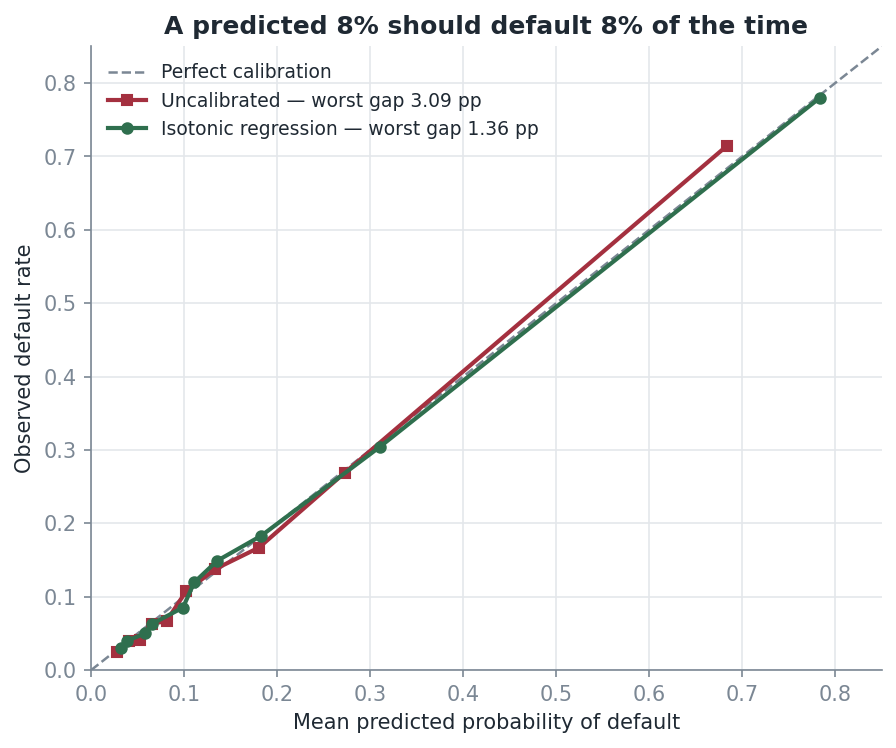
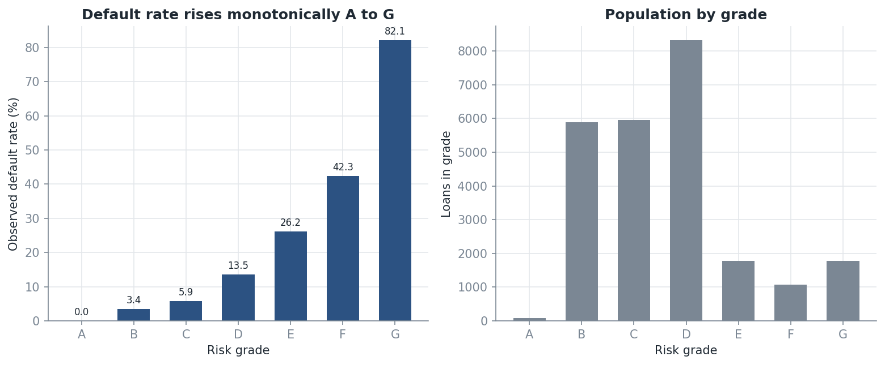
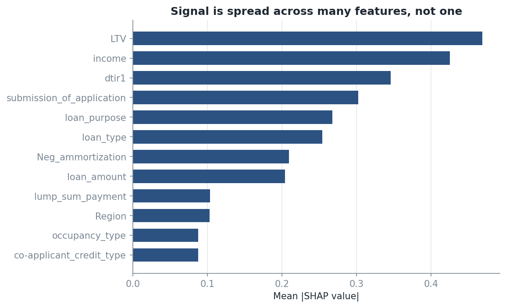

# Loan Default Prediction

An end-to-end credit-risk ML system that estimates probability of default, assigns
borrower risk grades, calculates expected credit loss, explains lending decisions,
and exposes the model through a production FastAPI service.

[](https://github.com/sadiqmuhd/Loan-Default-ML-Pipeline/actions/workflows/ci.yml)


---

## Live demo

| | |
|---|---|
| **Interactive API docs** | https://web-production-aaf08.up.railway.app/docs |
| **Readiness probe** | https://web-production-aaf08.up.railway.app/health/ready |
| **Model metadata** | https://web-production-aaf08.up.railway.app/v1/model/metadata |

Open `/docs`, expand `POST /v1/risk/assess`, hit **Try it out**. The form is
pre-filled with a real application from the dataset. Nothing to clone or install.

---

## Why credit risk, not just classification

Approving a loan is not a binary classification problem. A lender has to answer a
chain of questions, and only the first one is a model output:

- How likely is this borrower to default?
- **How much can I trust that number as a probability?**
- What is driving the risk, in terms I can put in a letter to the applicant?
- If they do default, how much do I actually lose?
- Is the expected loss small enough that the loan is still profitable?
- What happens to my whole book if house prices fall 30%?

A classifier answers the first. This project answers all six, which is the
difference between a model and a lending decision.

---

## System at a glance



---

## Model integrity: why the first model was thrown away

**The first working version scored a ROC-AUC of 1.0000.** Logistic regression,
random forest and XGBoost all scored exactly 1.0 on a held-out set, with zeros
off the diagonal of the confusion matrix.

That is not a good model. It is a broken one, and finding out why is the most
useful thing in this repository.

The dataset has a column called `Interest_rate_spread`, blank on about a quarter
of rows. Those blanks are not random:

```
Interest_rate_spread.isna()  ==  Status     on 148,670 of 148,670 rows  (100.00%)
```

Every single row. The column is only populated for loans that were actually
originated and priced, so its blankness is a *consequence* of the outcome, not a
predictor of it. The original feature engineering built a `_missing` indicator
from that column and fed it to the model — which is to say it handed the model
the answer key. Two such indicators carried **97.5% of total feature importance**,
and 82 of 87 features had importance of exactly zero, including credit score,
LTV, debt-to-income and income. It was not a credit model. It was a lookup table
on one NaN pattern.



| Pipeline | ROC-AUC | Rows | What it is |
|---|---:|---:|---|
| Original | **1.0000** | 148,670 | Reading the answer off a missingness pattern |
| Leakage-controlled | **0.8244** | 124,547 | An actual credit model |

The two curves sit on different populations *on purpose*. Removing the leakage
meant dropping the 24,123 rows whose missingness gave the game away, which also
moved the observed default rate from 24.6% to 16.3%. Hiding that by plotting
both on one filtered sample would have been its own small dishonesty.

The 1.0000 result is kept as a diagnostic finding and is never reported as this
project's performance. A regression test
([`tests/model/test_no_leakage.py`](tests/model/test_no_leakage.py)) fails the
build if any excluded column returns to the feature set, or if held-out AUC ever
climbs above a plausible ceiling again.

Full write-up: [`docs/LEAKAGE_INVESTIGATION.md`](docs/LEAKAGE_INVESTIGATION.md) ·
[`notebooks/02_leakage_investigation.ipynb`](notebooks/02_leakage_investigation.ipynb)

**Excluded from the feature set, and why**

| Columns | Reason |
|---|---|
| `rate_of_interest`, `Interest_rate_spread`, `Upfront_charges` | Populated only after origination and pricing. Their missingness encodes the target. |
| `Gender`, `age` | Protected characteristics. Excluded as a fair-lending safeguard; the API never collects them. |
| `ID`, `year` | Row identifier and a constant. No predictive content. |

---

## Dataset

148,670 mortgage applications, 34 columns.

| | |
|---|---:|
| Raw rows | 148,670 |
| Rows after complete-case filtering | 124,547 |
| Training / held-out test | 79,709 / 24,910 |
| Model features | 26 |
| Observed default rate | 16.32% |
| SHA-256 of the training file | `4234b122f463ff4d…` (recorded in model metadata) |

The CSV is not committed — 28MB has no place in a deploy image. A 5,000-row
sample (`data/portfolio_sample.csv`) is committed so the portfolio and stress
endpoints work from a clean clone. See [Local setup](#local-setup) for the full file.

---

## Modelling methodology

Three candidates, compared under stratified 5-fold cross-validation on the
training split only. Selection was on **PR-AUC**, not accuracy — at a 16% base
rate, a model that predicts "no default" for everyone is 84% accurate and
worthless.

| Candidate | CV PR-AUC | Selected |
|---|---:|:---:|
| Logistic regression | 0.3897 | |
| Random forest | 0.5596 | |
| **XGBoost** | **0.6191** | ✅ |

The final model was selected on ranking performance, probability calibration,
interpretability and stability rather than accuracy alone.

**Held-out test set — 24,910 loans never seen during training or calibration**

| Metric | Value | Reading |
|---|---:|---|
| ROC-AUC | **0.8244** | Ranking quality |
| Gini | 0.6489 | `2 x AUC - 1`, the industry convention |
| PR-AUC | 0.6104 | Against a 0.163 base rate |
| KS statistic | 0.4892 | Max separation between the two distributions |
| Brier score | 0.0933 | Accuracy of the probabilities themselves |
| Log loss | 0.3188 | |
| Mean predicted PD | 0.1654 | Against 0.1632 observed — a 0.22pp bias |

Deliberate choices worth defending:

- **No SMOTE.** Synthetic minority oversampling distorts the base rate, and a PD
  that no longer matches the observed default frequency is useless for pricing.
  A 16% positive rate is not severe imbalance.
- **No `scale_pos_weight`.** Same reason. It improves separation metrics while
  destroying calibration, and calibration is the whole point here.
- **Complete-case filtering, not imputation**, for the columns implicated in
  leakage. Imputing them would have smuggled the same signal back in through the
  imputation mask.



Overlapping distributions with a long right tail. A leaking model piles
predictions at 0 and 1; a real one on real credit data looks like this.

---

## Probability calibration

For a decision engine, ranking is not enough. If the model says 8%, then 8 out of
100 such loans need to actually default, or every downstream number — expected
loss, break-even, provisioning — is wrong.

Isotonic regression, Platt scaling and no calibration were all fitted on a
held-out calibration split and compared on the test set.



| Method | Brier | Mean gap | **Worst gap** | ROC-AUC |
|---|---:|---:|---:|---:|
| Uncalibrated | 0.09324 | 0.88pp | 3.09pp | 0.8249 |
| **Isotonic** ✅ | 0.09333 | **0.60pp** | **1.36pp** | 0.8244 |
| Platt (sigmoid) | 0.09382 | 2.36pp | 3.61pp | 0.8249 |

The honest reading: **isotonic is very slightly worse on Brier score and
marginally worse on AUC.** It was still chosen, because Brier score aggregates
sharpness and calibration together and can hide a badly-behaved tail. The worst
bucket-level gap falls from 3.09pp to 1.36pp, and the buckets that improve most
are the high-PD ones where the decision engine actually operates. Trading 0.0001
of Brier for a halved worst-case error in the region that drives declines is a
trade worth making.

---

## Credit risk engine

### Probability of default

`PD = P(default | application)` — the calibrated model output, at origination.

### Exposure at default

**`EAD = loan_amount`.** This dataset describes origination decisions, and holds
no outstanding balances, drawdown schedules or undrawn commitments. For a
fully-drawn term mortgage at origination, exposure *is* the loan amount, so a
credit conversion factor would be modelling something that does not exist here.
Stated as an assumption rather than dressed up as a model.

### Loss given default — an assumption-based proxy, not a model

**There is no LGD model here, and there could not be.** The dataset contains no
recovery cash flows, no workout costs and no resolution times. Any "LGD model"
trained on it would be fabricated.

Instead, a transparent collateral proxy, with every parameter in
[`config/risk_policy.yaml`](config/risk_policy.yaml):

```
recovery  = property_value x (1 - distressed_sale_haircut) x (1 - workout_cost_rate)
LGD       = clip(1 - recovery / EAD, floor, ceiling)
```

| Assumption | Value | Basis |
|---|---:|---|
| `distressed_sale_haircut` | 0.25 | Forced-sale discount to appraised value |
| `workout_cost_rate` | 0.10 | Legal, servicing and carrying costs |
| `floor` | 0.10 | No exposure is treated as fully recoverable |
| `fallback_lgd` | 0.45 | Used when property value is missing |

Every API response carries `assumptions.lgd_is_modelled: false` and an
`assumptions_version`, so no consumer can mistake the proxy for an estimate.
Change a haircut and the version changes with it.

### Expected loss

```
EL = PD x LGD x EAD
```

---

## Risk grades

Seven grades, defined by PD bands in `config/risk_policy.yaml`. These are a
project-level scale and are **not** claimed to correspond to any agency rating or
internal bank scale.



| Grade | PD band | Observed default rate | Loans |
|---|---|---:|---:|
| A | < 2% | 0.0% | 88 |
| B | 2–5% | 3.4% | 5,884 |
| C | 5–10% | 5.9% | 5,943 |
| D | 10–20% | 13.5% | 8,296 |
| E | 20–35% | 26.2% | 1,771 |
| F | 35–60% | 42.3% | 1,061 |
| G | > 60% | 82.1% | 1,767 |

Monotonicity is the property that matters, and it is enforced by a test rather
than asserted in prose: if a grade ever defaults more often than the grade below
it, the build fails.

**Grade A is thin — 88 loans and zero observed defaults.** Zero is not evidence
that the true rate is zero; the 95% upper bound on 0/88 is about 3.4%. The band
is honest about being under-populated rather than being quietly widened to look
better.

---

## Explainability

SHAP attributions, aggregated from one-hot columns back to source features, then
translated into codes an underwriter or applicant could actually use.



Signal is spread across many features — the shape you want, and the opposite of
the two-features-hold-97.5% pattern that exposed the leak.

Reason codes are value-aware, not just name-based. `HIGH_DTI` is only emitted
when the model penalised debt-to-income **and** the applicant's DTI is genuinely
high, so the code can never contradict the file:

| Application | PD | Grade | Decision | Reason codes |
|---|---:|:---:|---|---|
| Baseline example | 5.78% | C | APPROVE | `PURPOSE_RISK`, `CO_APPLICANT_CREDIT_RISK`, `LOAN_TYPE_RISK` |
| DTI 58%, LTV 95% | 98.70% | G | DECLINE | `HIGH_DTI`, `HIGH_LTV`, `LOAN_TYPE_RISK`, `PURPOSE_RISK` |
| Neg-am + balloon | 92.54% | G | DECLINE | `HIGH_DTI`, `BALLOON_REPAYMENT`, `NEGATIVE_AMORTISATION` |
| Investment property, LTV 92% | 98.99% | G | DECLINE | `HIGH_LTV`, `NON_PRIMARY_RESIDENCE`, `LARGE_EXPOSURE` |

**A limitation stated in the response itself:** SHAP is computed on the
*uncalibrated* score in log-odds space. Isotonic calibration is monotonic, so
signs and rankings carry to the calibrated PD, but the magnitudes are not
percentage-point contributions and the API says so rather than letting a consumer
assume otherwise.

---

## Decision engine

There are no hand-picked 0.3 / 0.6 thresholds. The cut-off is *derived* from the
economics in `config/risk_policy.yaml`:

```
lifetime_revenue_rate = annual_net_margin x expected_life_years   =  0.02 x 7 = 0.14
break_even_PD         = lifetime_revenue_rate / LGD
```

A loan is worth writing while `PD x LGD < expected margin`. Because the
break-even depends on LGD, **a well-collateralised loan is tolerated at a higher
PD than a thinly-collateralised one** — which is how lending actually works, and
which a fixed 0.3 threshold cannot express. A configurable band around the
break-even routes borderline cases to REVIEW instead of forcing a binary call.

---

## Portfolio analytics and stress testing

### Portfolio

| | |
|---|---:|
| Total exposure | 1,625,500,000 |
| Total expected loss | 41,288,808 |
| Expected loss rate | 2.54% |

Plus exposure and EL by grade, and Herfindahl–Hirschman concentration indices by
region and loan purpose.

### Stress scenarios

**These are assumption-driven sensitivity scenarios. They are not CCAR, not
DFAST, and not regulatory stress tests.** The dataset has a single constant year
value, so there is no macroeconomic time series to calibrate against and no
honest way to claim otherwise.

Shocks are applied to *inputs* and propagated through the whole chain — the model
is re-scored, it is never nudged directly:

```
property_value ↓ → LTV ↑ → PD ↑ (re-scored)
                 → collateral recovery ↓ → LGD ↑
                                          → EL = PD x LGD x EAD ↑
```

| Scenario | Shocks | Weighted PD | Weighted LGD | Expected loss | EL rate | Δ EL |
|---|---|---:|---:|---:|---:|---:|
| Base | — | 15.20% | 15.10% | 24,748,955 | 2.54% | — |
| Moderate | income −10%, property −15%, DTI +15% | 52.06% | 22.77% | 138,937,021 | 14.26% | +461% |
| Severe | income −25%, property −30%, DTI +35% | 83.77% | 33.37% | 296,256,425 | 30.40% | +1,097% |

**The severe scenario reports its own unreliability.** Each result carries an
extrapolation diagnostic, and under severe shocks 60.5% of the stressed book sits
beyond the 99th percentile of LTV in the unstressed portfolio, so the response
returns `confidence: "low"`. The model is being asked about applications unlike
anything it was trained on. The number indicates direction, not magnitude, and
the API says so rather than leaving the reader to assume three significant
figures are meaningful.

That self-reported caveat is the difference between a stress test and a
plausible-looking number.

---

## API

| Method | Endpoint | Purpose |
|---|---|---|
| `GET` | `/health/live` | Process is up |
| `GET` | `/health/ready` | Model loaded and serving — 503 until it is |
| `POST` | `/v1/risk/assess` | Score one application |
| `POST` | `/v1/risk/batch` | Score many, with per-row errors |
| `GET` | `/v1/model/metadata` | Version, features, assumptions, limitations |
| `GET` | `/v1/model/metrics` | Held-out metrics of the deployed model |
| `GET` | `/v1/model/policy` | Active risk policy and assumptions version |
| `GET` | `/v1/portfolio/summary` | Exposure, EL and concentration |
| `POST` | `/v1/portfolio/stress-test` | Run the scenarios |

### Example assessment

<details open>
<summary><b>Response from <code>POST /v1/risk/assess</code></b> (real output, trimmed)</summary>

```jsonc
{
  "request_id": "e99ab6fa-28d4-43dd-8884-b45d4b6891d4",
  "model_version": "v20260821T011832Z",
  "probability_of_default": 0.0578,
  "risk_grade": "C",
  "grade_description": "Modest risk",

  "loss": {
    "pd": 0.0578,
    "lgd": 0.10,
    "ead": 296500.0,
    "expected_loss": 1713.57,
    "expected_loss_rate": 0.00578,
    "collateral_value": 418000.0,
    "lgd_method": "collateral_proxy"
  },

  "decision": {
    "decision": "APPROVE",
    "reason": "PD 5.78% is below the break-even PD of 58.33% by more than the 5% review band.",
    "break_even_pd": 0.5833,
    "expected_profit": 37397.43
  },

  "explanation": {
    "reason_codes": ["PURPOSE_RISK", "CO_APPLICANT_CREDIT_RISK", "LOAN_TYPE_RISK"],
    "risk_drivers":  [{ "label": "Loan purpose", "value": "p3", "contribution": 0.118 }],
    "risk_reducers": [{ "label": "Loan-to-value ratio", "value": 70.9, "contribution": -0.548 }],
    "note": "SHAP is computed on the uncalibrated score in log-odds space..."
  },

  "assumptions_version": "1.0.0",
  "assumptions": { "lgd_is_modelled": false, "ead_method": "at_origination" },
  "latency_ms": 124.2
}
```
</details>

Design decisions behind it:

- **Request schema is generated from the data**, not hand-written. The original
  hand-written schema rejected 148,111 of 148,670 real records — 99.62% — while
  permitting eleven enum values that appear nowhere in the dataset. Enums and
  bounds now come from `config/data_contract.yaml`, and a test round-trips real
  rows through the API to prove the contract cannot drift from the data.
- **Batch failures are per-row.** One malformed application returns its own error
  at its own index while the rest of the batch still scores. A typed
  `list[LoanApplication]` would have 422'd the whole request — for a nightly run,
  one bad row costing the other 4,999 is not acceptable behaviour.
- **Correct status codes**: 422 invalid input, 503 model not loaded, 500 genuine
  server faults. Raw exceptions are never returned.
- Every response carries `request_id`, `model_version` and `assumptions_version`,
  and the same `request_id` appears in the structured log line for that request.

---

## Testing and quality

**214 tests, 85% coverage.** The ones worth pointing at:

| Test | What it defends |
|---|---|
| `test_no_leakage.py` | Excluded columns cannot return; AUC cannot exceed a plausible ceiling |
| `test_train_serve_parity.py` | Training and serving paths agree to 1e-12 on identical input |
| `test_schema_roundtrip.py` | Real dataset rows validate against the live API contract |
| `test_deployment_readiness.py` | The model artifact is **tracked by git**, not merely present on disk |
| `test_grades_and_stress.py` | Grade monotonicity; shocks propagate in the right direction |
| `test_training.py` | Two training runs from the same seed produce identical metrics |

The deployment-readiness tests exist because of a real failure: a stale
`.gitignore` rule excluded the retrained model, so the deployed service started
with no model and its health check failed for five minutes straight. Everything
passed locally, because locally the file was on disk. The question that mattered
was whether git tracked it — so now a test asks exactly that.

```bash
make test        # full suite
make lint        # ruff
make typecheck   # mypy, clean across 39 source files
```

CI runs lint → type check → tests → deploy smoke test on every push.

---

## Model governance

Every trained model writes an immutable, versioned directory:

```
artifacts/v20260821T011832Z/
├── model.joblib
├── metadata.json     # features, exclusions, hyperparameters, assumptions, limitations
└── metrics.json      # held-out metrics, candidate scores, calibration comparison
```

`metadata.json` records the training timestamp, the **SHA-256 of the training
data**, the random seed, the Python version and every library version, the exact
feature list, the excluded columns with reasons, and the model's stated
limitations. `GET /v1/model/metadata` serves it, so the deployed model can always
be interrogated about its own provenance.

See [`MODEL_CARD.md`](MODEL_CARD.md).

---

## Repository structure

```
├── src/loan_default/
│   ├── api/            # routers, schemas, dependencies, errors, middleware
│   ├── data/           # contract, loader, quality checks
│   ├── features/       # the single feature engineering implementation
│   ├── models/         # train, evaluate, calibrate, explain, segments, registry
│   ├── risk/           # grades, expected loss, policy, portfolio, stress
│   └── monitoring/     # PSI and drift detection
├── config/             # model.yaml, risk_policy.yaml, stress_scenarios.yaml,
│                       # data_contract.yaml
├── tests/              # unit / integration / api / model
├── notebooks/          # 01_eda, 02_leakage_investigation, 03_model_development
│   └── archive/        # the original leaking notebook, kept as evidence
├── docs/               # leakage investigation, Railway runbook, images
├── reports/            # fairness analysis, validation, metrics
├── scripts/            # figure and notebook builders
└── artifacts/          # versioned model + metadata + metrics
```

---

## Local setup

```bash
git clone https://github.com/sadiqmuhd/Loan-Default-ML-Pipeline
cd Loan-Default-ML-Pipeline
pip install -e ".[dev]"
```

Serve the committed model — no training required:

```bash
make serve
```

Then open http://localhost:8000/docs.

To retrain, download `Loan_Default.csv` from
[Kaggle](https://www.kaggle.com/datasets/yasserh/loan-default-dataset) into
`data/`, then:

```bash
make train && python scripts/build_figures.py
```

Training is deterministic — same seed, same metrics, verified by a test.

---

## Deployment

Deployed on Railway from the Dockerfile-free Nixpacks path, binding `$PORT` at
runtime. `/health/ready` returns 503 until the model is loaded, so Railway will
not route traffic to a container that cannot serve.

The model artifact is committed to the repository rather than fetched from object
storage. At 864KB with one artifact per deploy, an artifact store would add a
failure mode and a set of credentials to earn nothing. Documented as a decision,
not an oversight.

Runbook: [`docs/RAILWAY_DEPLOYMENT.md`](docs/RAILWAY_DEPLOYMENT.md)

---

## Limitations

This is a portfolio and educational implementation. It is not intended for, and
must not be used for, real lending decisions.

- **LGD is an assumption-based proxy, not a model.** No recovery data exists in
  this dataset. Results move with the configured haircuts.
- **EAD is the origination amount.** No drawdown or commitment data exists.
- **Stress scenarios are sensitivity analyses**, not macroeconomic stress tests.
  Under severe shocks the model extrapolates and reports low confidence.
- **No temporal validation.** The `year` column is constant, so out-of-time
  testing — the validation a real PD model would require — is impossible here.
- **Trained on originated loans only.** Applicants who were declined never appear
  in the data, so the model describes the through-the-door population that got
  approved, not all applicants. This is survivorship bias and reject inference
  would be needed to address it.
- **`Credit_Score` is not predictive** in this dataset (univariate AUC 0.503) and
  appears to be randomly generated. It is retained for contract completeness only.
- **The fairness analysis is not a compliance assessment.** Protected attributes
  were excluded as a model-design and fair-lending safeguard. Excluding them does
  not by itself eliminate proxy effects, and no claim of regulatory compliance is
  made. See [`reports/fairness_analysis.md`](reports/fairness_analysis.md).
- **Grade A holds 88 loans** and zero observed defaults — too thin to support a
  reliable rate.

---

## Future improvements

- Out-of-time validation, given a dataset with a real time dimension
- Reject inference to address the origination-only training population
- Survival modelling for time-to-default rather than a binary outcome
- Champion/challenger scaffolding with automatic drift-triggered retraining
- Empirical LGD modelling if recovery data ever became available

---

## Author

**Abubakar Sadiq Muhammad** ·
[GitHub](https://github.com/sadiqmuhd)

Dataset: [Loan Default Dataset](https://www.kaggle.com/datasets/yasserh/loan-default-dataset) (Kaggle, 148,670 mortgage applications).
